## Itzakard proyecto Sprint #1 de la especialización UX

## Reto:
Entender y optimizar el journey de tomar un camión de CDMX-Cuernavaca.

## Objetivo de proyecto
Conocer todo el proceso de diseño de una solución tecnológica

## Identificando las areas de oportunidad, para poder establecer objetivos de negocio para lograr el punto de acuerdo con el usuario, y construir un producto/servicio que se rija por este acuerdo.

### ¿Quien es el cliente de mi solución, mi consumidor final?
### ¿La idea/oportunidad satisface o genera una necesidad?
### Mapa de empatía

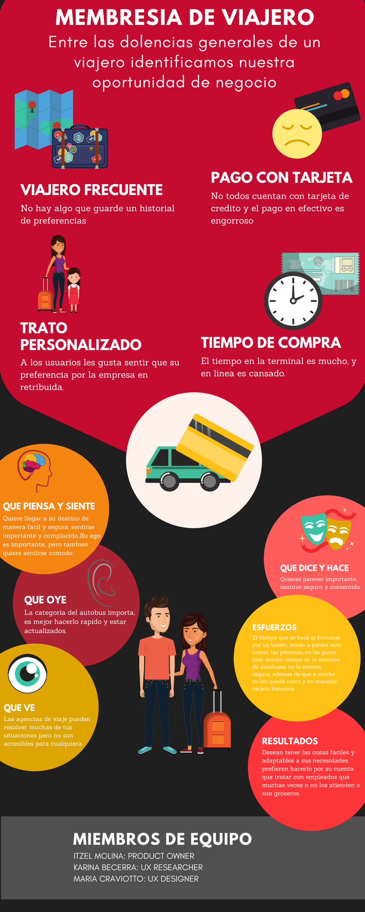

## Definiendo perfiles de usuarios viajeros

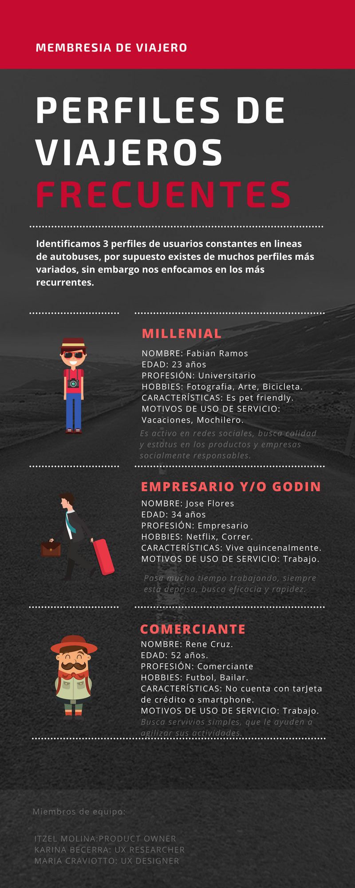

## Resultados de la investigación

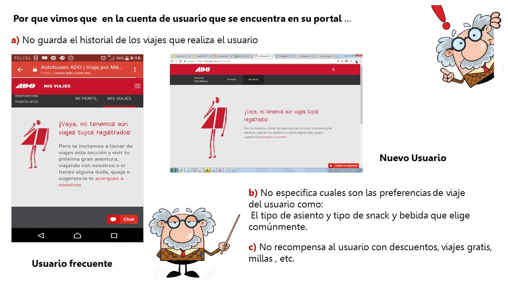
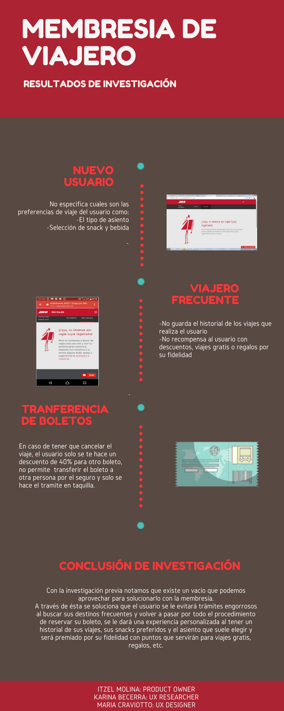

## Descripción de la posible solución
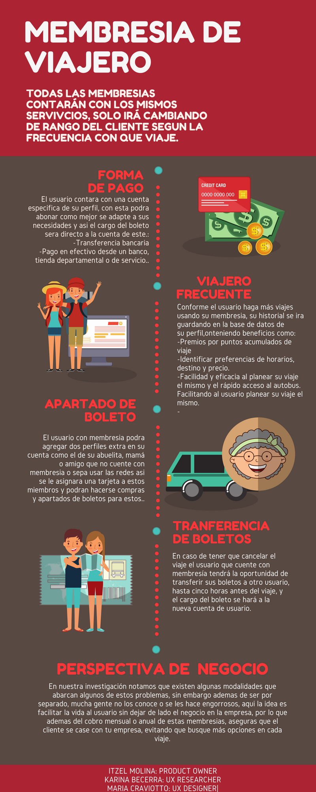

## Definiendo el enunciado del problema
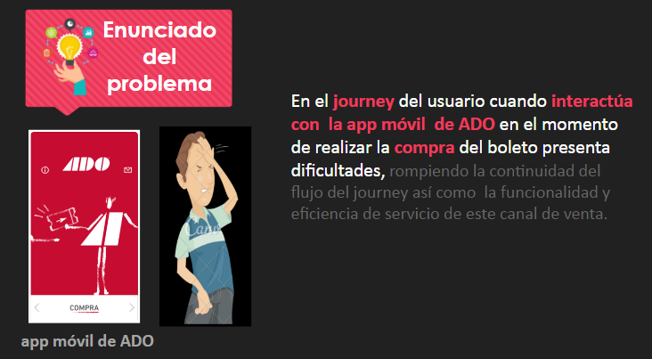

## Definiendo perfil de usuario general
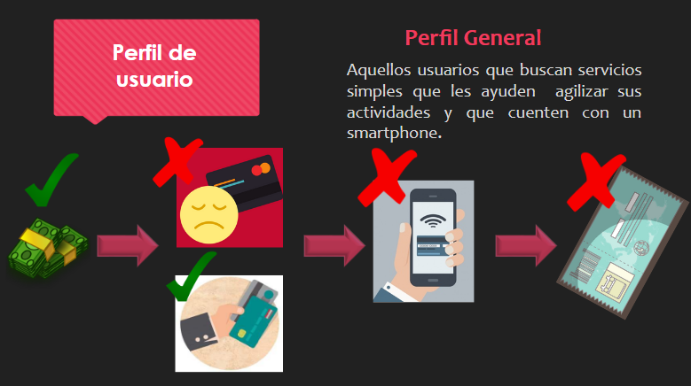

## Definiendo perfil de usuario particular
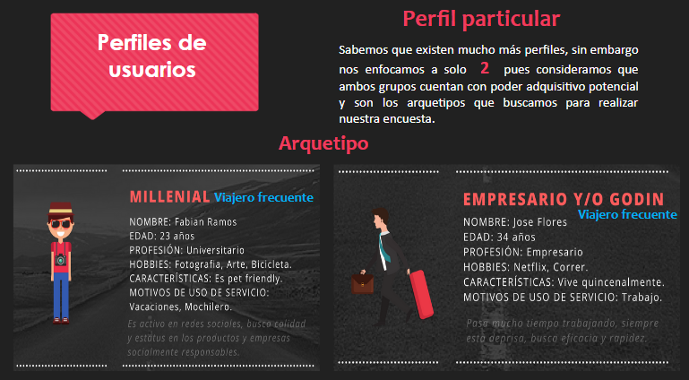

## Definiendo las necesidades del usuario
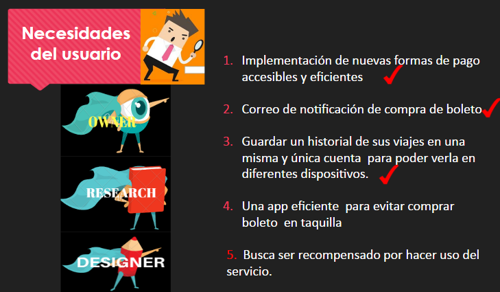

## Definiendo objetivo de negocio
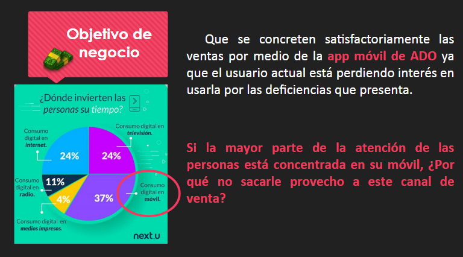

## Insights de la primera encuesta
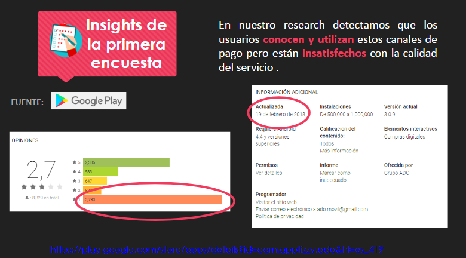
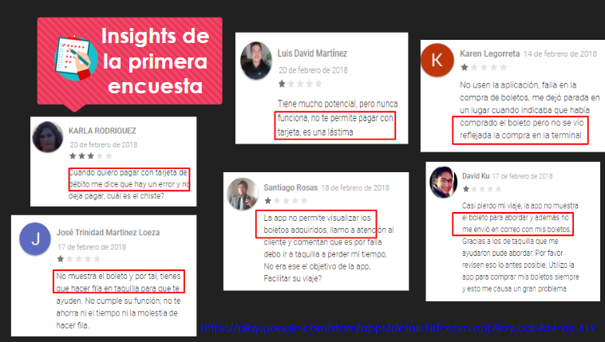
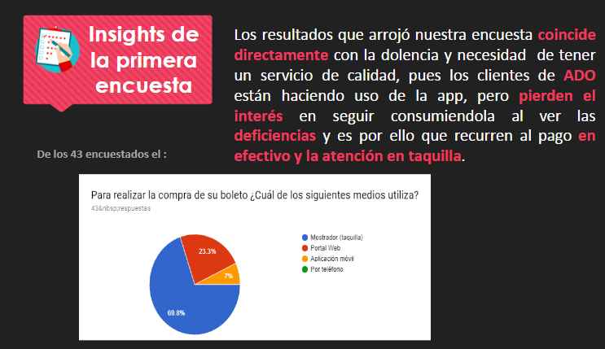
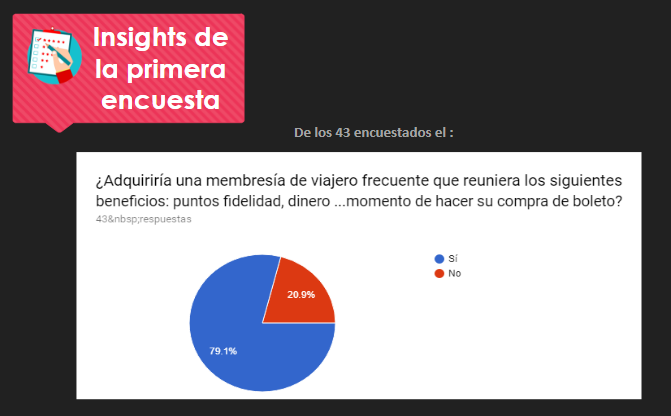
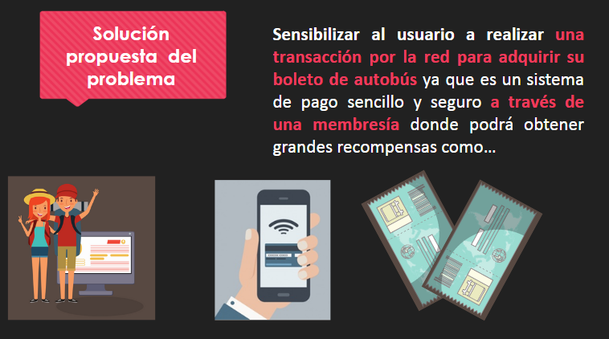

## Solución propuesta a el enunciado problema

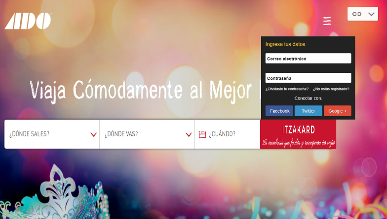
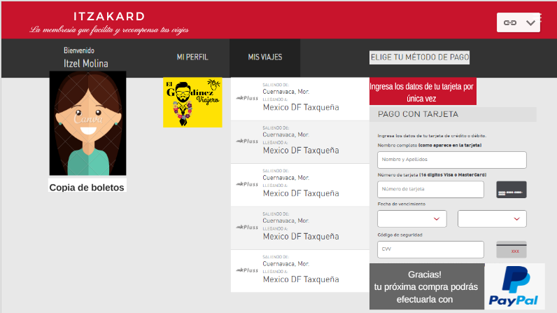

## Beneficios clave
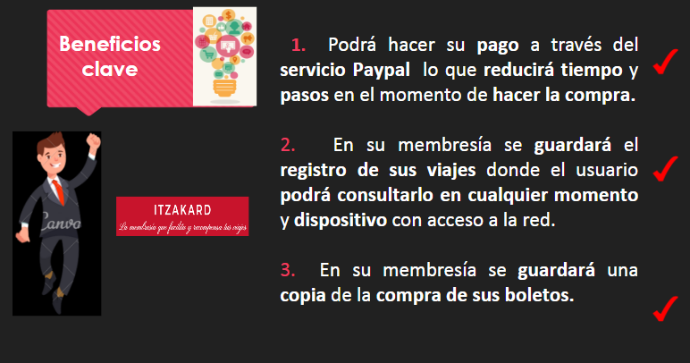

## Insights Google_Analytics
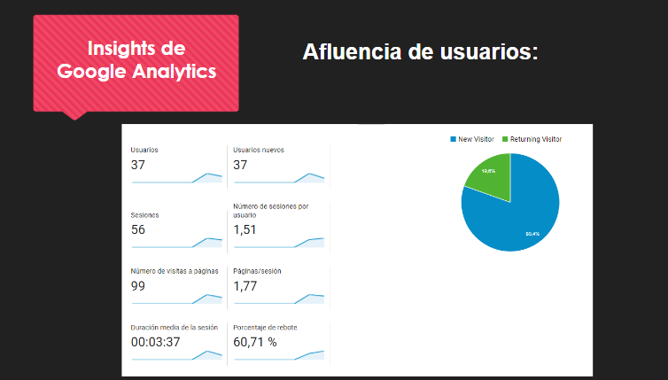
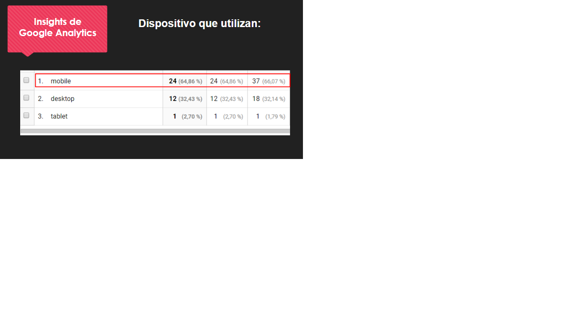
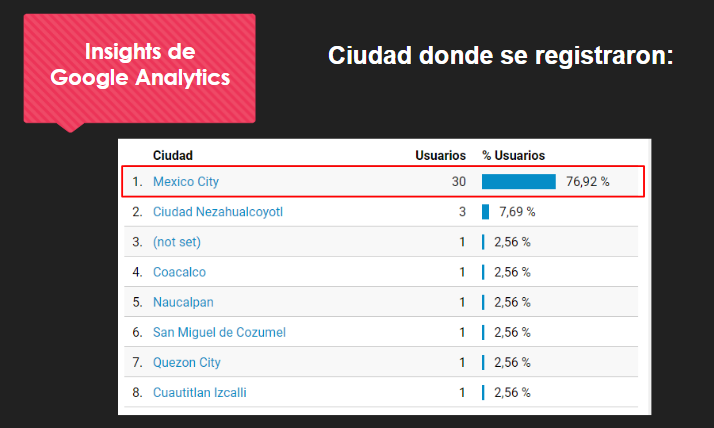

## Insights Hotjar
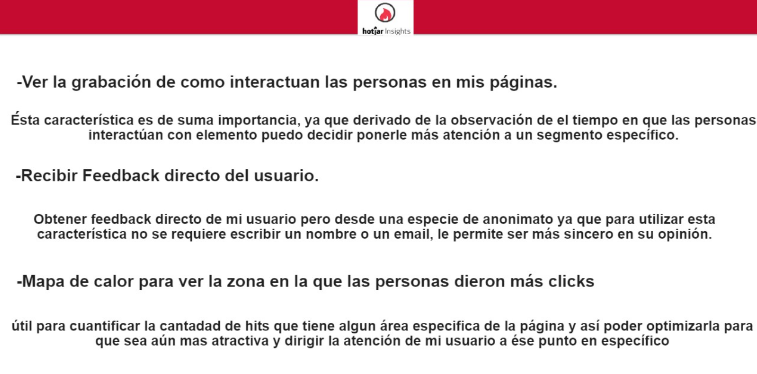

## Herramientas utilizadas en este proyecto
* Canva
* Google Analytics
* Google Forms
* Hotjar
* Materialize
* Trello 
